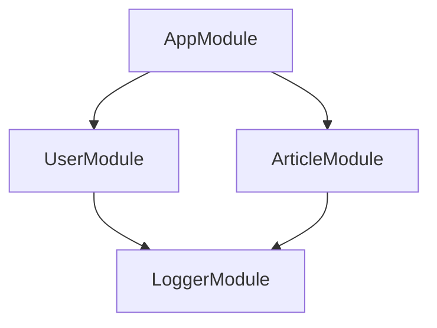

# Modules

The home page examples are mostly plug and play, and ideally, Subversify behaves
as you would expect in most cases. For some use cases however, it can be helpful
to understand some of the internals at a high level.

## Module Lifecyle

Modules in Subversify are just classes that implement the Inversify
[`AsyncContainerModule`
interface](https://github.com/inversify/InversifyJS/blob/master/wiki/container_modules.md),
wich means they can be loaded with the Inversify `loadAsync` container method.

So a module is a `class`, which will be instantiated, and loaded into a
container.

These three stages in a module lifecycle are important to understanding the more
advanced use cases discussed in this section, so let's introduce some terms:

### Module Definition

A module definition is your `class` definition. It represents the structure of
the module, which defines how it will behave when instantiated and loaded.

At this stage, the module is simply a blueprint with no execution or state.

```typescript
import { Module } from "@subversify/core";

export class AppModule extends Module {
  imports = [];
  bindings = [];
  exposes = [];
}
```

### Module Instance

A module instance is created by instantiating the `class`, which means we now
have an instance of an `AsyncContainerModule`.

You could think of this as an instantiated factory&mdash;it has a copy of the
module definition (`imports`, `bindings`, and `exposes` properties) but hasn’t
yet created an internal container or performed any bindings.

This instance can be loaded one or more times into a "parent" container. The act
of loading is what activates the module.

```typescript
const appModule = new AppModule();
```

### Activated Module

An activated module is the result of loading a module instance into a container.
This is when the module creates a private module container, registers it's
internal bindings, and exposes some of those bindings to the loading container. 

```typescript
import { Container } from "inversify";
import { AppModule } from "./app.module";

container.loadAsync(new AppModule()).then(() => {
  /* Exposed bindings now registered in `container` */
});
```

> [!NOTE]
>
> You don't get access to an activated module's module container, by design. It
> is not bound or returned anywhere. If you need to extend Subversify's
> behaviour, you can consider [Hooks](./hooks.md).

## Module Container

The module container is what actually holds your bindings&mdash;as described
earlier, it is created when a module is loaded into a "parent" container [^3].

### Module Container Default Scope

The module container has a `defaultScope` of `Singleton`.

Any bindings defined in your module are therefore also singletons, unless you
specify a full [binding definition](./bindings.md#binding-definition) and
customize the scope in the `prepare()` function.

## Module Roots

The first time a module is loaded into a container - either into your
application container with `loadAsync`, or into another module via `imports` -
it also becomes a **module root** [^1].

A module root defines a "module registry", which is shared by all the modules
imported from this root. The module registry ensures that any module is only
ever instantiated **once** within a given module graph (effectively: modules are
also singletons, by default).

Consider the following module graph, where `AppModule` forms the module root:

<figure>


<figcaption>Logger is depended on multiple times</figcaption>
</figure>

The `App` loads the `User` and `Article` modules. Both `User` and `Article` load the
`Logger` Module.

If modules were registered without checking for previous instances, `User` would
instantiate and load `Logger` once (which [activates the
module](#activated-module) and creates a module container), and then `Article`
would load instantiate and load `Logger` again.

The second `Logger` module instance would not be "activated", and would result
in a second module container being created, which would mean duplicate
bindings, and duplicate services.

> [!WARNING]
>
> Module singleton behaviour means you should only have one module root per
> root container&mdash;loading multiple modules into a root container creates
> multiple module roots, is not explicitly supported, and may be harder to
> debug.


## Module Factories[^2]

For a given [module root](#module-roots), additional modules imported using
their class constructor as a reference will be singletons.

Some use cases require more flexibility&mdash;usually infrastructure concerns
like database integrations, caches, and so on.

Since Subversify modules are just classes, it's possible to use normal factory
patterns to create different configurations of the same module.

You can implement your factories any way you want, but the [NestJS Community
Guidelines](https://docs.nestjs.com/fundamentals/dynamic-modules#community-guidelines)
define a very reasonable convention of `register`, `forRoot`, `forFeature`,
etc, so we'll use that approach here:

```typescript
import { Module } from "@subversify/core";

// Define our module extending from the Module class
class SomeModule extends Module {}

// Define our static factory methods as a standalone object
const SomeModuleFactory = {
  register(config: any) {
    return new SomeModule({
      imports: [/* ... */],
      bindings: [/* ... */],
      exposes: [/* ... */],
    })
  }
}

// Export our factory and rename it for consistency
export { SomeModuleFactory as SomeModule };
```

**Why not use static class methods?**

:    You can, if you really prefer, but the class constructor will exposed to
     other modules, and other modules may accidentally use the constructor in
     `imports` instead of the static methods:

     ```typescript
     class SomeModule extends Module {
       static register() {
         return new this({ /* ... */ });
       }
     }

     class OtherModule extends Module {
       /**
        * No error, but OtherModule will instantiate an empty module, which is
        * probably not what you want
        */
       imports = [SomeModule];
     }  
     ```

> [!INFO]
>
> It is not possible to access the container directly in factory methods,
> because they are being executed "outside" the Subversify registration loop.
>
> It is possible to access the container when binding in the `prepare` function
> of a [binding definition](./bindings.md#binding-definition), however, via the
> default Inversify `context` parameter:
>
> ```typescript
> {
>   identifier: "SOME_IDENTIFIER",
>   prepare(bind) {
>     return bind.toDynamicValue((context)) => {
>       return new SomeClass(context.container.get("OTHER_DEPENDENCY_IDENTIFIER");
>     }
>   }
> }
> ```
>
> This is how the example Todo app retrieves a data source when binding
> `forFeature` repositories:
>
> ```typescript
> const bindings: Binding[] = entities.map((entity) => ({
>   identifier: RepositoryIdentifier(entity, dataSource),
>   prepare(bind) {
>     bind
>       .toDynamicValue((context) =>
>         context.container.get<DataSource>(DataSourceIdentifier(dataSource)).getRepository(entity),
>       )
>       .inSingletonScope();
>   },
> }));
> ```

## Global Modules

Importing the same core modules throughout your application can be cumbersome
for common functionality such as database or logging services.

Subversify provides a `@Global` decorator to mark a module as global, and a
[Hook](./hooks.md) to opt-in to this behaviour in a given [module
root](#module-roots).

For example, we can define a global `Logger` module providing a service:

```typescript { title="logger.module.ts" }
import { Global, Module } from "@subversify/core";
import { LoggerService } from "./logger.service";

@Global()
export class LoggerModule extends Module {
  bindings = [LoggerService];
  exposes = [LoggerService];
}
```

And we can import this in our module root, and apply the `GlobalHook`:

```typescript { title="app.module.ts" }
import { GlobalHook, Module } from "@subversify/core";
import { LoggerModule } from "./logger/logger.module";
import { UserModule } from "./user/user.module";
import { UserService } from "./user/user.service";

export class AppModule extends Module {
  hooks = [GlobalHook()];
  imports = [LoggerModule, UserModule];
  exposes = [UserService];
}
```

And then we can depend on our logger services without explicitly importing them
in other modules:

```typescript { title="user.service.ts }
import { injectable } from "inversify";
import { LoggerService } from "../logger/logger.service";

@injectable()
export class UserService {
  constructor(logger: LoggerService) {
    logger.log(this.constructor.name, 'initialized with', logger);
  }
}

```

> [!WARNING]
>
> Global modules can introduce coupling and portability problems in your
> application's modules

## Patterns

As repeated often throughout this documentation, modules are just classes, which
provides for a lot of flexibility in how to define them. This flexibility may
not always be a good thing, but you are free to choose pattern(s) that work for
you.

This documentation uses public class fields as a shorthand:

```typescript
class UserModule extends Module  {
  imports = [];
  bindings = [];
  exposes = []
}
```

You could also define a module by overriding the constructor and calling `super`:

```typescript
class UserModule extends Module {
  constructor() {
    super({
      imports: [],
      bindings: [],
      exposes: []
    })
  }
}
```

You could use static class methods, but as noted in [Module
Factories](#module-factories), this potentially creates confusion if a user
references the class constructor instead of calling the static method:

```typescript
/**
 * WARNING: UserModule is still a valid module, but it will have no
 * bindings / exposed bindings
 */
class UserModule extends Module {
  static register(options?: any) {
    return new this({
      imports: ["..."],
      bindings: ["..."],
      exposes: ["..."]
    });
  }
}
```

If factory functions are needed, it is suggested to separate the `Module` from the factory:

```typescript
class UserModule extends Module {}

const UserModuleFactory = {
  register(options?: any) {
    return new UserModule({
      imports: [],
      bindings: [],
      exposes: []
    })
  }
}

// Optionally rename the export for consistent naming with static modules
export { UserModuleFactory as UserModule };
```

In simple use cases, these differences aren't very important. They become more
important if you are using [Hooks](./hooks.md) and are aiming for stricter [type
safety](./hooks.md#type-safety) (largely because public class fields cannot be
generic in TypeScript).

[^1]: Module Roots are just a concept; there is no direct reference to the term in the source code
[^2]: These are called Dynamic Modules in NestJS
[^3]: Techically, the module container is created the _first_ time a module is
    registered into a parent container. See [Module Roots](#module-roots) for
    more in depth details